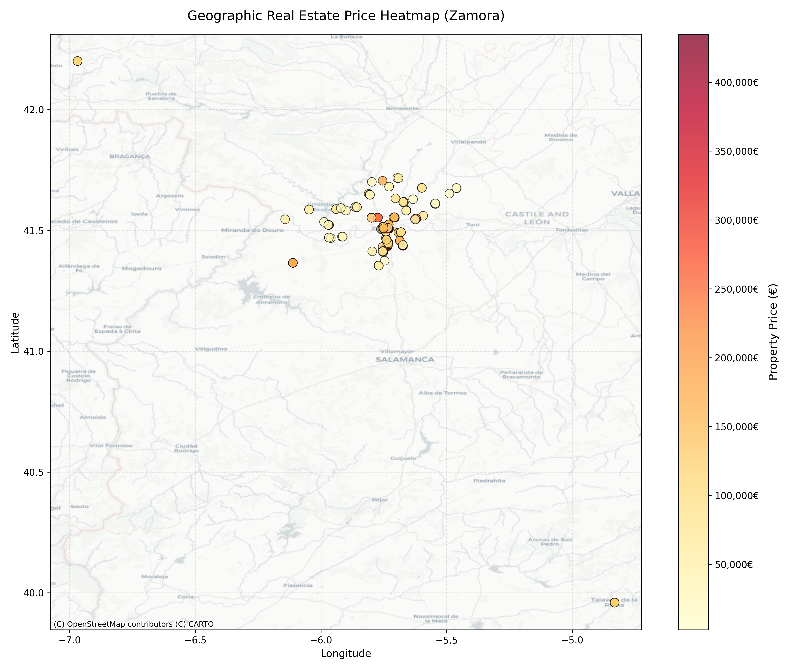
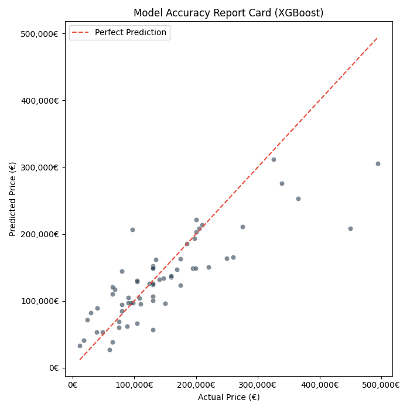

# 🏡 Zamora Real Estate Valuation & Spatial Analytics Engine

An end-to-end data pipeline built to scrape, geocode, map, and predict housing market valuations across the province of Zamora, Spain. The system uses geographic feature engineering, advanced spatial projection alignments, and a regularized **XGBoost** regression model to unlock real estate market insights.

---

## 🌟 Key Capabilities

* 🌐 **Automated Scraping & Geocoding:** Extracts raw property records safely using `beautifulsoup4` and `curl-cffi`, leveraging `geopy` to transform unstructured text addresses into precise physical coordinates.
* ✂️ **Geographic Noise Scrubbing:** Automatically applies a tight bounding box filter (41.1°N to 42.2°N / -6.3°W to -5.3°W) to drop erroneous listings geocoded outside the region.
* 🧠 **Location-Aware Machine Learning:** Builds custom spatial features—such as a continuous radius map calculating the exact distance from Zamora city center—allowing tree-based models to catch neighborhood value premiums without data leakage.
* 🛡️ **Outlier Isolation:** Protects model performance against high luxury-pricing anomalies using log-target scaling (`np.log1p`) combined with a robust feature transformation layer (`RobustScaler`).

---

## 🏗️ Project Blueprint

The codebase is organized into modular scripts designed for clean production deployment:

* 📁 `src/` — **The Core Engine**
  * 📜 `generate_map.py`: Handles GPS data processing, Web Mercator projection alignments (EPSG:3857), and spatial visualization outputs.
  * 📜 `train.py`: Manages feature scaling, spatial feature engineering, and competitive machine learning model training loops.
* 📁 `data/processed/` — **Data Cache**
  * 📊 `zamora_houses_clean.csv`: Cleaned housing data populated with active geographic coordinates.
* 📁 `outputs/` — **Pipeline Assets**
  * 🤖 `models/`: Persistent storage for serialization files (`best_house_predictor.pkl`, `robust_scaler.pkl`).
  * 🖼️ `plots/`: Exported high-resolution market heatmaps and validation charts.

---

## 📊 Pipeline Validation & Model Competition

By moving away from messy text locations and leaning on raw coordinates plus the city-center distance radius feature, the machine learning models gained stable predictive power. During training validation, **XGBoost** outperformed Random Forest across all core metrics.

### ⚔️ The Showdown: Random Forest vs. XGBoost

| Performance Metrics | 🌲 Baseline Random Forest | 🚀 Spatial XGBoost Pipeline | 🏆 Top Performer |
| :--- | :--- | :--- | :--- |
| **Average Prediction Error (MAE)** | 37,002.81 € | **36,347.81 €** | **XGBoost** |
| **Variance Explained (R² Score)** | 0.6218 | **0.6628** | **XGBoost** |
| **Leakage & Overfitting Shield** | Handled | **Handled** | **Tie** |
| **Extreme Price Resilience** | Moderate | **High (L1/L2 Regularized)** | **XGBoost** |

---

## 🖼️ Market Visualizations

### 🗺️ Geographic Property Value Heatmap
This visualization uses `geopandas` and `contextily` to project real coordinates into Web Mercator meters. This step removes the typical horizontal stretch distortion found in raw latitude plots, rendering real estate density directly on top of a sharp, proportional city map.

### 📈 Model Accuracy Diagnostics
The prediction scatter plot compares actual pricing against model expectations. The resulting graph shows tight clustering along the diagonal line, proving that the XGBoost pipeline effectively accounts for structural value differences while mitigating wide variance loops.

